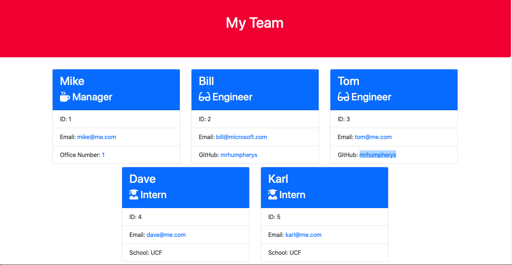

# team-profile-generator

# Description
Team Profile Generator is an interactive app using node.js, inquirer, File System Module, and Jest. When you run 'node index.js' in the command line you will be prompted to answer questions about your team, starting with the team manager. You can add team members titled engineer and intern. After you have selected all your team members you can finish the project, which will generate the team profile in html format. The new file is created in the 'dist' folder in the root of the project. Each team member card has clickable links for email. The manager card has a link for an office number, the engineer card has a link to GitHub, and the intern card lists their school. A live recording of using the application can be viewed [here](https://drive.google.com/file/d/1hR6abhKncCn_CFexCgh0d2qdcuynfpcA/view).

# Table of Contents
- [Installation](#installation)
- [Usage](#usage)
- [License](#license)
- [Contributing](#contributing)
- [Tests](#tests)
- [Questions](#questions)

# Installation
Run 'npm init' then 'npm install' in the root of the project in the command line.

# Usage
Run 'node index.js' in the root of the project in the command line.

# License
This project is covered by the [MIT](https://spdx.org/licenses/MIT.html) license.

# Contributing
Michael Humpherys

# Tests
Currently there five tests in four test suites testing the four classes used to create the final HTML page. Run 'npm run test' in the command line to run the tests. The test are run using the Jest JavaScript testing framework.

# Questions
Feel free to contact me with any questions at my email or GitHub. [Email](mailto:mrhumpherys@gmail.com), [GitHub](https://github.com/mrhumpherys)